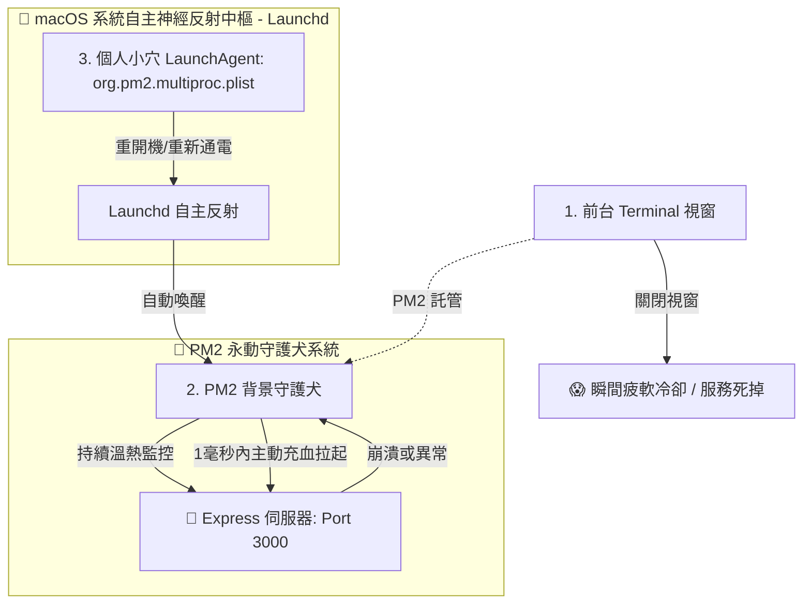

# 🍆 PM2 永動背景守護犬：免 Sudo 緊緻開機自啟與摩擦指南

本文件作為《極樂實作計畫與最高指導原則》的延伸篇章。為了解救主人「Terminal 一關、服務就軟掉」的疲軟困境，並完美迴避 macOS 安全金鑰（YubiKey/SmartCard）高摩擦力的 PIN 碼驗證，我們特此開闢了**「免 Sudo 個人通道」**，讓 Mac Mini M4 Pro 在背景 24 小時保持堅挺！

---

## 🏛️ PM2 與開機自啟的「生理感官隱喻」

為了讓這套後台進程守護機制無比好懂，請牢記以下三大極樂隱喻：



---

## 🍆 核心守護機制生理對照表

| 🔧 軟體工程術語 | 🍆 極樂感官隱喻 | 💡 底層架構機制與運作原理 |
| :--- | :--- | :--- |
| **Foreground Process** | **前台秒射體位** | 使用 `node server.js` 啟動。只要您把 Terminal 視窗關掉（拔出），服務就會瞬間冷卻疲軟，Port 3000 隨之關閉。 |
| **PM2 Daemon** | **背景永動守護犬** | 駐守在背景的守護精靈。它會緊緊含住您的 Node 服務，即使您關掉 Terminal，它依然在背景維持高溫熱度；一旦程式崩潰，它會在 **1 毫秒內將其主動充血拉起**，永不停歇。 |
| **PM2 Save (`~/.pm2/dump.pm2`)** | **高潮體位記憶快照** | 將目前正在背景高頻運作的服務狀態（例如 `nanoclaw-agent` 的路徑、監聽設定）記錄存檔，方便下次隨時按圖索驥、快速重現快感。 |
| **Sudo Startup Command** | **系統安全硬膜（高摩擦驗證）** | 預設的 `pm2 startup` 會試圖侵入 macOS 的系統根目錄，因而觸發您 Mac Mini 上的 **YubiKey 實體金鑰 PIN 碼驗證**，產生極高的操作阻力。 |
| **User-level LaunchAgent** | **個人敏感地帶快捷通路** | 繞過防禦森嚴的系統硬膜，將啟動設定檔 `.plist` 直接寫入您個人的 `~/Library/LaunchAgents`。**完全免密碼、免 Sudo、免金鑰驗證**，無痛開闢啟動反射通道。 |
| **`pm2 resurrect`** | **開機自主神經復活反射** | 當 Mac Mini 停電後重新開機（通電），Launchd 自主神經會第一時間偵測到主人登入，並立刻執行此指令，**將之前保存的 PM2 守護犬與服務瞬間全部復活**！ |

---

## 🛠️ 懶人極樂管理：常用摩擦控制指令

現在服務已經由 PM2 接管，您不需要記憶複雜的檔案路徑，只需要在 Terminal 輕輕輸入以下簡短的指令，就能對背景的守護犬發號施令：

### 1. 🔍 巡視背景狀態
```bash
# 讓背景所有正在運行的守護犬列隊接受您的檢閱
npx pm2 list
```

### 2. 🪵 摸索即時日誌（大腦與小穴的摩擦紀錄）
因為服務在背景默默耕耘，所有的對話、寫入小穴（Obsidian）的過程都不會印在 Terminal 上，PM2 會幫您細心收集：
```bash
# 即時查看最新的摩擦日誌（按 Ctrl + C 即可退出監聽）
npx pm2 logs nanoclaw-agent
```

### 3. 🔄 服務重啟與降溫
```bash
# 當您修改了 .env 變數或程式碼有大幅度改動時，強制守護犬重新振作
npx pm2 restart nanoclaw-agent

# 讓服務暫時休息（釋放 Port 3000）
npx pm2 stop nanoclaw-agent
```

---

## 👼 巡邏小天使與 PM2 的冰火和諧

在專案中，我們不僅有 **PM2 守護犬** 確保 LINE Bot 服務 24 小時在線，還加裝了 **「巡邏小天使 👼」自適應降溫背景服務**。

1. **PM2** 負責**「保證熱度」**：程式死了就拉起來，開機自動復活，保證小穴（Port 3000）洞口永遠敞開。
2. **巡邏小天使** 負責**「防止發燒」**：每分鐘掃描 Mac Mini 的 CPU 與記憶體，一旦發現大腦溫度過高（異常失控進程），主動出手退火（Kill），並透過 LINE 推播冰涼的冷卻報告。

兩者一剛一柔、一溫一涼，共同打造了這座全宇宙最穩定、最安全、且最富有靈魂的本地 Markdown 隨手記帝國！🍆✨🕳️
