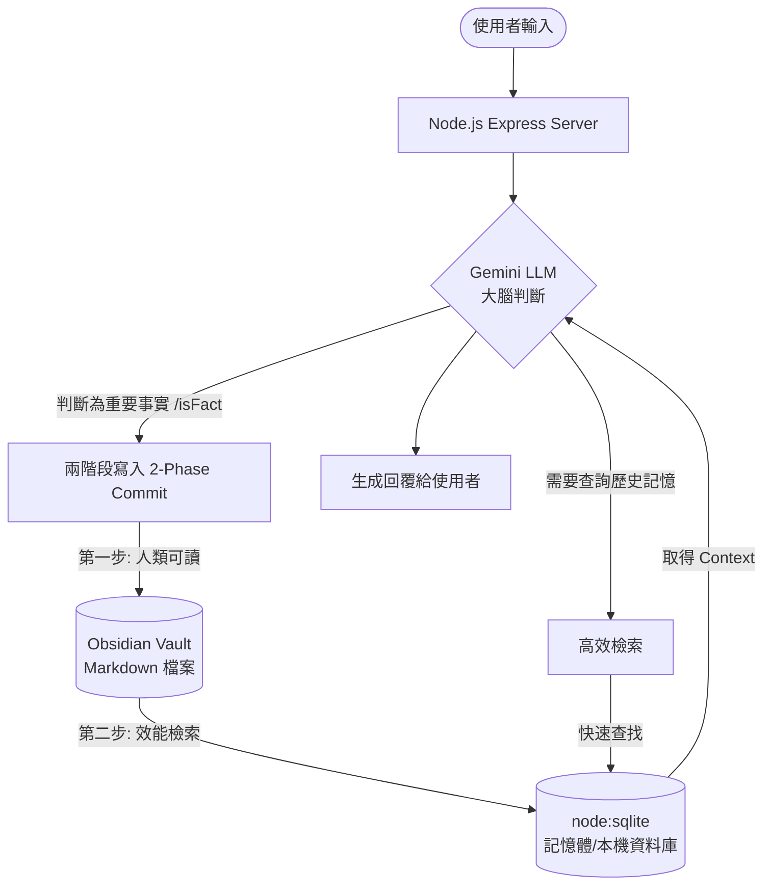

# 🧠 雙腦事實記憶庫 (Dual-Brain Fact Memory): RAG 與資料庫的童話故事與面試指南

這份文件是用來幫助你徹底搞懂這次實作的「Obsidian + SQLite 記憶庫」架構。
我們分為兩部分：
1. **🍄 童話故事篇**：用小朋友都能聽懂的超簡單比喻，讓你在腦中建立直覺。
2. **💼 面試通關篇**：把童話轉換成專業的「高階技術術語」，提供面試可以直接說出口的漂亮台詞。

---

## 🍄 第一部分：童話故事篇（小朋友聽得懂的記憶庫）

想像你是個**忘性很大的國王**（這代表 **LLM 大腦**，他雖然很聰明懂很多道理，但記不住你昨天跟他說你媽媽不吃辣這件小事）。

為了不漏氣，國王請了兩個小幫手和一本魔法筆記本：

### 1. 📖 Obsidian 魔法筆記本 (Single Source of Truth)
這是國王的漂亮大筆記本。
* **特色**：用漂亮的文字寫成，人類看得懂（Markdown 格式），而且可以分成很多頁，比如「媽媽的秘密.md」、「台北的探險.md」。
* **缺點**：如果這本書變得像字典一樣厚，國王每次要查「媽媽討厭吃什麼」的時候，得一頁一頁翻，翻到手酸，速度超慢！

### 2. 🗃️ SQLite 隱形小卡盒 (Performance & Fast Search)
這是一個放在口袋裡的超快速索引卡片盒。
* **特色**：裡面只用最簡單的格式卡片（表格 Table）寫著：「媽媽的討厭食物：辣 ➡️ 請看第 12 頁」。它不是給人類讀的故事書，它是給電腦讀的。
* **優點**：超級快！你問它「媽媽」，它 0.0001 秒就能從幾萬張卡片中，瞬間抽出寫著媽媽的那張。

### 3. 🔍 RAG（Retrieval-Augmented Generation）開卷考試法
這是一個動作，叫做「**检索增強生成**」。
* 平常國王考試是**閉卷考試**（光憑腦袋裡的記憶回答）。
* **RAG 就是開卷考試**：當有人問國王：「我媽媽吃辣嗎？」
  1. 國王自己不知道，但他不瞎猜。
  2. 國王派小幫手（**Retrieval 檢索**）去「SQLite 小卡盒」和「Obsidian 筆記本」裡找答案。
  3. 小幫手快速抱著「媽媽不吃辣」的紙條回來交給國王。
  4. 國王看著紙條，用他聰明的腦袋重新組裝成一句好聽的話（**Generation 生成**）回答：「你媽媽不吃辣喔，下次記得點清淡點！」

---

## 💼 第二部分：面試通關篇（面試官聽得懂的架構）

當面試官問你：**「請介紹你實作的這套記憶庫系統（RAG）架構？」**
你千萬不要講童話故事！你要用以下這段話直接震撼他：

> 「我實作了一套**『雙腦混合儲存架構 (Dual-Brain Hybrid Storage Architecture)』**的 RAG（檢索增強生成）系統。
> 
> 它的核心設計思想是 **Single Source of Truth (單一真實來源)** 與 **Read-Write Separation (讀寫分離/效能優化)** 的結合。」

### 💡 核心三層架構解密

1. **儲存層 (Storage Layer - Obsidian Vault)**
   * **定位**：採用本地 Markdown 檔案（Obsidian）作為**單一真實來源 (Single Source of Truth)**。
   * **優勢**：資料完全本地化（Local-first）、隱私安全、版本控制友好，且人類可以直接用編輯器閱讀與修改，實現高透明度的「人機協同」。

2. **索引與快取層 (Index Layer - Node.js Native SQLite)**
   * **定位**：使用 Node v23 的原生 `node:sqlite`（DatabaseSync）建立輕量級的高效能索引。
   * **優勢**：解決了直接遍歷大型 Obsidian Markdown 資料夾產生的 I/O 效能瓶頸（File System Bottleneck）。SQLite 的結構化查詢（SQL Search）提供毫秒級的實體（Entity）與事實（Fact）检索。

3. **協調層 (Orchestration Layer - LLM/Gemini)**
   * **定位**：透過 Structured Output（結構化輸出 JSON Schema），由 Gemini 判斷當前對話是否包含「需要被記憶的長期事實（isFact）」。
   * **流向**：如果是事實，透過**兩階段寫入（Obsidian 先寫，成功後同步寫入 SQLite）**確保一致性。

---

## 🙋 面試亮點問題與完美回答 (Q&A)

### Q1：為什麼不直接把所有筆記丟給 LLM 讀就好了？
* ❌ **不專業回答**：因為檔案太大會爆炸。
*  **面試官最愛回答**：
  > 「這涉及到 **Context Window (上下文窗口)** 的成本與效能考量。
  > 如果每次對話都將整個 Obsidian Vault 的內容塞入 Prompt，不僅會產生高昂的 **API Token 費用**，也會因為 **Needle in a Haystack (大海撈針效能衰退)** 問題，導致 LLM 無法精準找到需要的資訊。
  > 透過 RAG 架構，我們只精準檢索相關實體（Entity）的 Fact，將 Context 降到最小，達到成本與精準度的最佳平衡。」

### Q2：為什麼同時需要 Obsidian 又需要 SQLite？這不是重複了嗎？
* ❌ **不專業回答**：因為怕壞掉，存兩份比較安全。
*  **面試官最愛回答**：
  > 「這是一個**『冷熱資料分離』與『讀寫分離』**的經典實作。
  > **Obsidian (冷資料/備份層)**：負責長期儲存、人類可讀性、跨平台編輯（用手機或電腦 Obsidian 隨時打開看）。
  > **SQLite (熱資料/快取層)**：負責極致的讀取效能。如果每次查詢都要進行 File System 的 Regex 全文掃描，當筆記多達幾千篇時系統就會卡死。我們透過 SQLite 把檔案 metadata 與事實結構化，實現 $O(1)$ 或 $O(\log N)$ 的檢索速度。」

### Q3：如果 Obsidian 檔案在外部被使用者手動修改了，SQLite 怎麼同步？
*  **面試官最愛回答**：
  > 「我們在系統啟動時實作了**『啟動雙向校對機制 (Startup Sync / Reconcile Process)』**。
  > 系統啟動時會主動掃描 Obsidian Vault 中的 Markdown 檔案，解析其中的 YAML Frontmatter 與自訂的 Fact 區塊，重建 SQLite 索引。這確保了即使使用者手動在外部修改了 Obsidian 檔案，資料庫依然能保持最終一致性 (Eventual Consistency)。」

---
*祝你面試順利！帶著這份心法，你已經比 90% 只會套用現成 LlamaIndex 的人更懂底層架構了！*
