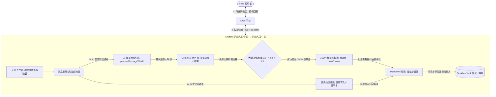

# 📋 LINE 機器人 Markdown 隨手記代理人：童趣實作計畫與最高指導原則

本文件為專案的**最高指導原則**。為了讓複雜的 Node.js 非同步串流、安全簽章防禦、AI 備用探針鏈以及本地檔案追加邏輯變得無比直覺好懂，本專案首創**「童趣故事比喻架構法」**。

我們將抽象的軟體工程名詞，完全對照至最可愛的城堡冒險、魔法小工具與彩色糖果紙上，在腦海中建立最堅固的記憶錨點。

---

## 🏛️ 系統架構與技術棧 (童趣比喻版)

---

## 🐶 核心概念與童趣比喻對照表

為了能瞬間理解整個專案的代碼骨架，請隨時對照以下核心比喻：

| 🔧 軟體工程術語 | 🎈 童趣比喻 | 💡 底層架構機制與運作原理 |
| :--- | :--- | :--- |
| **HTTP POST Request (`/callback`)** | **外部投遞的信件** | 外部 LINE 伺服器主動發起 POST Webhook 請求，試圖將含有文字或圖片的 Payload 資料送入伺服器內部。 |
| **Signature Verification Middleware** | **城堡大門的安全衛兵** | 位於 Webhook 最前線的安全守門員。透過雜湊簽章比對仔細核對通行證，確保進來的信件安全無虞，將壞人死死拒於門外。 |
| **Readable Stream & Buffer** | **新鮮的牛奶接接樂** | 在 LINE 下載圖片時，數據是一滴滴以 Stream 形式流出，我們必須用 chunks 容器細心接住，最後融合成 Buffer，再轉為純白 Base64 數據送給 Gemini。 |
| **Model Fallback Chain** | **多層次備用魔法棒** | `gemini-2.5-flash` 衝鋒首選，若遇到 503 等阻力自動切換至穩定的 `2.0` 與 `1.5` 魔法棒，直到順利做成 JSON 結構的小糖果。 |
| **Obsidian Vault Directory** | **魔法小抽屜** | `./obsidian_vault` 本地儲存空間。啟動時會透過 `ensureVaultDirExists` 主動進行整理，確保魔法小抽屜隨時可以容納新筆記。 |
| **Multiline Formatting (`\n`)** | **乖乖排隊防漏對齊排版** | 當筆記包含多行文字時，如果直接寫入會從列表符號 `*` 旁邊漏出去（排版跑版）。因此必須實施首行直接排在最前，後續行數**側身退後四步（縮排四格）**的排隊規矩。 |
| **Local Sandboxed Execution** | **安全防護罩運行** | 本地運行的 `qwen2.5:14b` 大腦由於是在您的 Mac Mini M4 Pro 內完全離線、沙盒運行，等同於戴上防護帽，數據絕對不會外流，100% 安全無毒。 |
| **Dialogue Session Memory** | **對話小記憶寶盒** | 透過 `userSessions` 記憶池，溫暖保存主人最近 15 輪的對話餘溫，提供連貫的語境理解，拒絕冷冰冰的一夜情式對話。 |
| **Two-stage Hybrid RAG** | **二階段大腦智慧聯想** | 結合當前對白、最近 7 天日記背景、與深度檢索出的歷史筆記，再次送入 Gemini 大腦進行大腦聯想與語意推理分析，產出極富靈魂與溫度的 Markdown 回覆。 |
| **Butterfly Effect Simulator** | **未來日記的命運預言沙盒** | 結合假設情境與過往歷史軌跡、近期日記背景，在 Obsidian 中生成三條明日模擬日記分支，並給予高智商決策指引。 |

---

## 🧠 升級：對話記憶與二階段 RAG 推理系統（含蝴蝶效應預言機）

我們為大腦加裝了全新的語意關聯、記憶系統與決策沙盒預言機，使其具備高智商推理與命運推演能力：

---

## 🛠️ 最高指導原則與開發規範

1.  **專情原則（單一模型守護）**：
    *   在本地端 AI 部署上，為了讓 Mac Mini 24GB 記憶體保持絕對清爽與極致的思考速度，我們**專一使用 `qwen2.5:14b` 這款黃金大腦**。不進行複雜的混亂多模型切換，達到 100% 的極速快感與穩定度。
2.  **雙軌對稱註解排版（最優雅的雙軌排版）**：
    *   **AI 自動遵循原則**：本專案後續由 AI 代理人所產生的任何新程式碼、擴充功能或重構改動，**必須且將自動**採用此雙軌對稱註解方法，無須使用者重複提醒。
    *   在程式碼中，所有註解必須採用**縱向分行對稱排版**，分為 `[技術]`（極致嚴謹的軟體科學說明）與 `[童趣]`（童話故事感官比喻）兩條支線，給予開發者雙重的閱讀快樂。
    *   所有產生的程式碼在編寫註解時，應使用 **繁體中文**，且**不可包含 '繁體中文註解：' 的前綴**。
3.  **防禦性安全機制**：
    *   對外（Express Entry）：以大門衛認證為尊，非安全連線一概阻絕。
    *   對內（Markdown Store）：以乖乖排隊防漏對齊排版為綱，嚴防任何多行文字溢出排版邊界。

---

有了這套無比直覺、生動且嚴謹的**最高指導原則**，無論是多麼深奧的異步代碼，在您眼中都將變得像童話故事一樣簡單好記！讓我們帶著這股快樂能量，繼續照顧您的 Markdown 本地儲存城堡吧！🌟✨🐶
