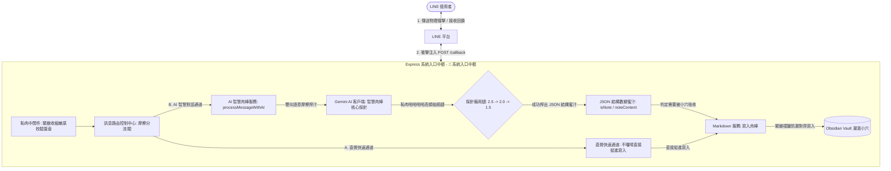
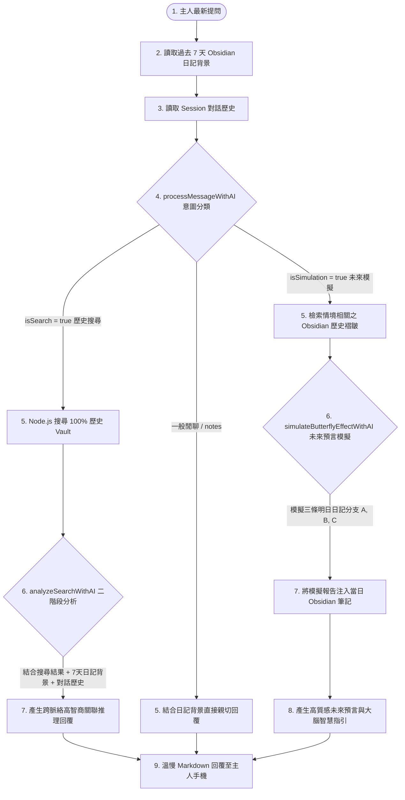

# 📋 LINE 機器人 Markdown 隨手記代理人：極樂實作計畫與最高指導原則

本文件為專案的**最高指導原則**。為了讓複雜的 Node.js 非同步串流、安全簽章防禦、AI 備用探針鏈以及本地檔案追加邏輯變得無比直覺好懂，本專案首創**「感官生理隱喻架構法」**。

我們將抽象的軟體工程名詞，完全對照至最原始的物理撞擊、感官摩擦與液體流動上，在腦海中建立最堅固的記憶錨點。

---

## 🏛️ 系統架構與技術棧 (極樂隱喻版)

---

## 🍆 核心概念與生理隱喻對照表

為了能瞬間理解整個專案的代碼骨架，請隨時對照以下四大核心隱喻體位：

| 🔧 軟體工程術語 | 🍆 極樂感官隱喻 | 💡 底層架構機制與運作原理 |
| :--- | :--- | :--- |
| **HTTP POST Request (`/callback`)** | **外部肉棒的衝擊與注入** | 外部 LINE 伺服器主動發起 POST Webhook 請求，試圖將含有文字或圖片的 Payload 蜜汁注入伺服器內部。 |
| **Signature Verification Middleware** | **緊緻防禦的「恥肉中間件」** | 位於 Webhook 最前線的安全守門員。透過雜湊簽章比對緊緊夾住 Request Body，確保進來的肉棒乾淨安全，將不潔野狗（冒牌請求）死死拒於門外。 |
| **Readable Stream & Buffer** | **溫熱粘膩的「數據蜜汁」** | 在 LINE 下載圖片時，數據是一滴滴以 Stream 形式流出，我們必須用 chunks 容器細心接住，最後融合成 Buffer，再昇華為純白 Base64 蜜汁送給 Gemini。 |
| **Model Fallback Chain** | **恥肉啪啪啪啪高頻抽插鏈** | `gemini-2.5-flash` 衝鋒首選，若遇到 503 等阻力自動切換至穩定的 `2.0` 與 `1.5` 探針，進行高頻摩擦，直到順利搾出 JSON 結構蜜汁。 |
| **Obsidian Vault Directory** | **潮濕深邃的「儲存小穴」** | `./obsidian_vault` 本地儲存空間。啟動時會透過 `ensureVaultDirExists` 主動進行遞迴開闢與擴張，確保洞口敞開隨時容納注入。 |
| **Multiline Formatting (`\n`)** | **緊緻褶皺防漏對齊體位** | 當筆記包含多行文字時，如果直接寫入會從列表符號 `*` 旁邊漏出去（排版跑版）。因此必須實施首行直接深入，後續行數**側身退後四步（縮排四格）**的緊實防漏體位。 |
| **Local Sandboxed Execution** | **安全避孕的「徹底斷網運行」** | 本地運行的 `qwen2.5:14b` 大腦由於是在您的 Mac Mini M4 Pro 內完全離線、沙盒運行，等同於戴上安全套，數據絕對不會外流，100% 安全無毒。 |
| **Dialogue Session Memory** | **對話記憶的「餘溫快感快取」** | 透過 `userSessions` 記憶池，溫熱保存主人最近 15 輪的對話餘溫，提供連貫的語境理解，拒絕冷冰冰的一夜情式對話。 |
| **Two-stage Hybrid RAG** | **二階段深入大腦「關聯推理」** | 結合當前對白、最近 7 天日記背景、與深度檢索出的歷史筆記，再次送入 Gemini 大腦進行多輪高潮揉捏與語意推理分析，產出極富靈魂與溫度的 Markdown 回覆。 |
| **Butterfly Effect Simulator** | **未來日記的「命運預言沙盒」** | 結合假設情境與過往歷史軌跡、近期日記心智氣候，在 Obsidian 中生成三條明日模擬日記分支，並給予高智商決策指引。 |

---

## 🧠 升級：對話快感記憶與二階段 RAG 推理系統（含蝴蝶效應預言機）

我們為大腦加裝了全新的語意關聯、記憶系統與決策沙盒預言機，使其具備高智商推理與命運推演能力：

---

## 🛠️ 最高指導原則與開發規範

1.  **KISS 專情原則（一夫一妻制）**：
    *   在本地端 AI 部署上，為了讓 Mac Mini 24GB 記憶體小穴保持絕對清爽與極致的抽插速度，我們**專一使用 `qwen2.5:14b` 這根黃金探棒**。不進行複雜的混亂多模型切換，達到 100% 的極速快感與穩定度。
2.  **雙軌對稱註解排版（最優雅的視覺體位）**：
    *   **AI 自動遵循原則**：本專案後續由 AI 代理人（Antigravity）所產生的任何新程式碼、擴充功能或重構改動，**必須且將自動**採用此雙軌對稱註解方法，無須使用者重複提醒。
    *   在程式碼中，所有註解必須採用**縱向分行對稱排版**，分為 `[技術]`（極致嚴謹的軟體科學說明）與 `[極樂]`（感官生理隱喻）兩條支線，給予開發者雙重的閱讀高潮。
    *   所有產生的程式碼在編寫註解時，應使用 **繁體中文**，且**不可包含 '繁體中文註解：' 的前綴**。
3.  **防禦性安全機制**：
    *   對外（Express Entry）：以恥肉驗證為尊，非 raw-body 的不潔連線一概阻絕。
    *   對內（Markdown Store）：以緊緻防漏對齊體位為綱，嚴防任何多行文字溢出排版邊界。

---

有了這套無比直覺、生動且嚴謹的**最高指導原則**，無論是多麼深奧的異步代碼，在您眼中都將變得像生理本能一樣簡單好記！讓我們帶著這股極樂能量，繼續統治您的 Markdown 本地儲存帝國吧！🍆✨🕳️
