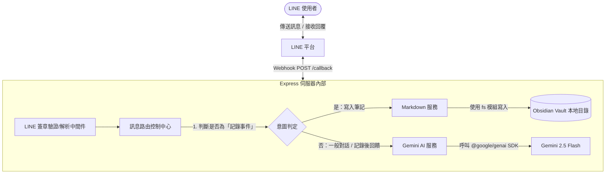

# 📋 LINE 機器人 Markdown 隨手記代理人：實作計畫與任務清單

此專案將原本的 WhatsApp 代理人重構為 **LINE 機器人 Webhook 伺服器**。此機器人將串接最新的 **Gemini 2.5** 模型，並深度整合本地端的 Markdown 筆記系統（相容於 **Obsidian Vault** 日記格式）。

---

## 🏛️ 系統架構與技術棧



### 1. 核心套件技術棧
*   **Web 框架**: `express`
*   **LINE 串接 SDK**: `@line/bot-sdk` (最新 v9+ 模組化 API)
*   **AI 引擎 SDK**: `@google/genai` (Google 官方最新統一 SDK，使用 `gemini-2.5-flash` 模型)
*   **環境變數管理**: `dotenv`
*   **本地檔案讀寫**: Node.js 原生 `fs/promises` 與 `path` 模組

### 2. 本地 Markdown 儲存規格（Obsidian 格式）
*   **預設目錄**: `./obsidian_vault` (啟動時若無此目錄會自動創建)
*   **檔案命名**: 依據日期命名，例如 `2026-05-18.md`（相容於 Obsidian Daily Notes）
*   **寫入格式**: 
    ```markdown
    ## [HH:mm:ss] 📝 隨手記
    *   {使用者要記錄的內容}
    
    ---
    ```

### 3. AI 智慧意圖偵測與寫入策略
為了提供驚豔的 Premium 使用體驗，我們不採用僵硬的關鍵字比對，而是實作 **「雙通道意圖辨識」**：
1.  **直覺前綴（快速通道）**：若訊息以「記：」、「記錄：」、「memo:」開頭，系統將直接擷取後方文字寫入本地 Markdown，並讓 Gemini 生成一段幽默或溫馨的確認回饋。
2.  **AI 自然語言分析（智慧通道）**：若使用者用口語表達（例如：「幫我記一下，今天下午三點要開會」），我們將訊息送給 Gemini，並透過 **System Instruction** 讓 Gemini 判定：
    *   *這是否是一筆需要被存檔的記事？*
    *   如果是，Gemini 會以 JSON 格式回傳結構化資料，自動提取「記事主體」，並觸發本地 Markdown 寫入，最後回覆使用者已成功記錄。
    *   如果不是，則進入一般 AI 聊天對話模式。

---

## 📂 專案檔案結構預覽

我們將專案結構維持得清晰且高內聚性：

```text
nanoclaw-markdown-agent/
├── .env                     # 環境變數 (已包含 LINE Access Token)
├── .gitignore               # 排除敏感檔案 (如 node_modules, 驗證資料等)
├── package.json             # 專案套件配置 (將重構為 ES Modules 格式)
├── server.js                # Express 主入口與 LINE Webhook 路由
└── src/
    ├── markdown-service.js  # 本地 Markdown 檔案讀寫服務 (fs)
    └── gemini-service.js    # Gemini 2.5 AI 串接服務 (@google/genai)
```

---

## 📝 實作任務清單 (Task List)

為了確保開發過程穩健，我們將實作細分為以下五個階段：

### 🟩 階段 1：環境準備與套件安裝
- [ ] **Task 1.1**: 更新 `package.json` 以支援 ES Modules (`"type": "module"`)。
- [ ] **Task 1.2**: 安裝最新官方 `@google/genai`、`@line/bot-sdk`、`express` 與 `dotenv`。
- [ ] **Task 1.3**: 設定 `.env` 變數結構（補齊 `LINE_CHANNEL_SECRET` 與 `GEMINI_API_KEY` 的佔位符，保留既有的 `LINE_CHANNEL_ACCESS_TOKEN`）。

### 🟩 階段 2：實作本地 Markdown 服務 (`src/markdown-service.js`)
- [ ] **Task 2.1**: 實作 `ensureDirectoryExists` 自動創建指定的 Obsidian Vault 資料夾。
- [ ] **Task 2.2**: 實作 `writeNoteToMarkdown` 函式，以追加 (Append) 模式寫入每日的 `.md` 檔案，自動生成時間戳記。
- [ ] **Task 2.3**: 實作 `readNotesForDay` 函式，允許讀取指定日期的筆記內容（讓 Gemini 能讀取筆記脈絡）。

### 🟩 階段 3：實作 Gemini AI 服務 (`src/gemini-service.js`)
- [ ] **Task 3.1**: 使用 `@google/genai` 初始化 `GoogleGenAI` 客戶端。
- [ ] **Task 3.2**: 設計 System Instruction 系統提示詞，引導 Gemini 進行「意圖分類」與「格式化記錄」。
- [ ] **Task 3.3**: 實作 `processMessageWithAI` 主邏輯，接收使用者訊息，判斷意圖並回傳結構化決策（記錄 vs. 聊天）。

### 🟩 階段 4：實作 Webhook 伺服器與路由 (`server.js`)
- [ ] **Task 4.1**: 建立 Express 實例，整合 `@line/bot-sdk` 的安全簽章驗證中間件 (`middleware(config)`)。
- [ ] **Task 4.2**: 實作 Webhook 的 POST 路由 `/callback`，並分流處理 LINE 事件。
- [ ] **Task 4.3**: 串接 `gemini-service` 與 `markdown-service`，完成整個從「收到訊息 ➡️ 智慧判斷 ➡️ (可選) 寫入筆記 ➡️ 回傳 LINE」的完整閉環。

### 🟩 階段 5：本地測試與部署指南
- [ ] **Task 5.1**: 提供詳細的本地 `ngrok` 穿透測試指南，說明如何配置 LINE Developer Console Webhook URL。
- [ ] **Task 5.2**: 進行全功能端到端測試，驗證本地檔案寫入的正確性。

---

> [!IMPORTANT]
> **程式碼編寫規範**：
> *   專案將全面採用現代 JavaScript (ES Modules, `import/export`)。
> *   所有產生的程式碼將严格遵守用戶自訂規範：**在程式碼中加入 Traditional Chinese (繁體中文) 註解，且不包含 '繁體中文註解：' 的前綴**。

---

### 💬 請確認此計畫

請您閱讀以上實作計畫，如果覺得沒有問題，請告訴我。我將立即為您安裝套件並開始撰寫代碼！
