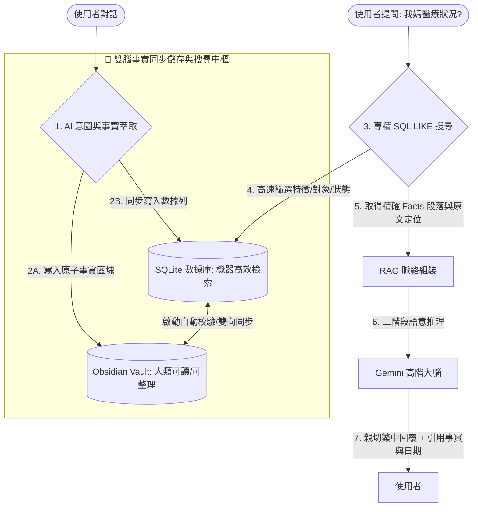

# Implementation Plan - Obsidian + SQLite 雙腦長期事實記憶庫

為了解決隨手記大檔案、Obsidian Vault 擴大後全文檢索缓慢且雜亂的問題，並完美實現「取代 ChatGPT 長期記憶」的客觀事實儲存與高智商 RAG 語意查尋，我們提出 **「Obsidian（人類可讀資料源） + SQLite（機器高速搜尋引擎）雙腦同步事實庫」** 架構。

---

## 🏛️ 系統架構設計 (Double-Brain Architecture)



---

## 1. Obsidian 「原子事實區塊」格式設計 (Atomic Fact Block)

為了讓人類在 Obsidian 閱讀時保持無比精美與舒適，且方便 Node.js 使用正則表達式（Regex）精準解析，我們設計了 **「隱藏標記 + 標準列表」** 的混合格式。

### 📄 事實區塊範例 (寫入 `entities/mother.md` 或當日隨手記)：
```markdown
<!-- fact_start id="fact_20260527_001" -->
* **日期**: 2026-05-27
* **對象**: person_mother
* **領域**: medical
* **事實**: 母親目前住在高雄美樹大悅，由印尼看護 Susi 協助生活，且與 Susi 關係融洽。
* **來源**: chatgpt_memory
* **可信**: high
* **狀態**: current
<!-- fact_end -->
```

### 💡 設計優勢：
1. **人類可讀**：在 Obsidian 閱讀/預覽模式下，HTML 註解 `<!-- fact_start ... -->` 和 `<!-- fact_end -->` 是**完全隱藏**的！人類只會看到標準美觀的 Markdown 項目列表，可自由閱讀與修改。
2. **機器極速解析**：Node.js 可以用極其簡單的正則表達式，在數微秒內把所有區塊與其 `id`、欄位精準抓出來：
   ```javascript
   const factRegex = /<!-- fact_start id="([^"]+)" -->([\s\S]*?)<!-- fact_end -->/g;
   ```

---

## 2. SQLite 本地高速索引資料庫設計 (Database Schema)

資料庫儲存於專案根目錄下 [`data/facts.db`](file:///Users/pac/codes/nanoclaw-markdown-agent/data/facts.db)。
使用 Node.js v23 內建的 `node:sqlite` (零依賴、同步高效的 `DatabaseSync` 引擎)。

### 📊 `facts` 資料表欄位設計：
```sql
CREATE TABLE IF NOT EXISTS facts (
    id TEXT PRIMARY KEY,          -- 唯一事實 ID (如 fact_20260527_001)
    entity_id TEXT NOT NULL,      -- 事實對象 (如 person_mother, person_father, global)
    domain TEXT NOT NULL,         -- 事實領域 (如 medical, caregiving, finance, tech)
    date TEXT NOT NULL,           -- 事實發生/記錄日期 (YYYY-MM-DD)
    claim TEXT NOT NULL,          -- 事實的具體陳述句 (claim)
    source TEXT NOT NULL,         -- 事實來源 (如 user_report, chatgpt_memory, doc_scan)
    confidence TEXT NOT NULL,     -- 信心度 (high, medium, low)
    status TEXT NOT NULL,         -- 事實狀態 (current, outdated)
    file_path TEXT NOT NULL,      -- 原文 Obsidian 檔案路徑 (相對路徑，方便定位)
    created_at INTEGER NOT NULL,  -- 記錄建立時間戳記
    updated_at INTEGER NOT NULL   -- 記錄最後修改時間戳記
);
```

### 🔍 查詢加速索引 (Indexes)：
```sql
CREATE INDEX IF NOT EXISTS idx_facts_entity ON facts (entity_id);
CREATE INDEX IF NOT EXISTS idx_facts_domain ON facts (domain);
CREATE INDEX IF NOT EXISTS idx_facts_status ON facts (status);
```

---

## 3. 雙腦雙向自動同步機制 (Bi-directional Sync)

當 Agent 每次啟動時，會主動運行 **「雙腦同步協議 (Double-Brain Alignment Sync)」**：

1. **掃描與寫入 (Obsidian ➡️ SQLite)**：
   * 遞迴掃描 Obsidian `entities/`、`domains/` 與每日日記中的所有 `.md` 檔案。
   * 讀取並使用正則抓出所有 `fact_start` 區塊。
   * 比對該 `id` 是否已在 SQLite 中：
     * **若不存在**：直接將事實插入 SQLite。
     * **若已存在且內容不同**（例如人類手動在 Obsidian 修改了事實描述）：自動更新 SQLite 對應欄位，並記錄 `updated_at`！
2. **清除無效事實 (SQLite ➡️ Obsidian)**：
   * 如果 SQLite 內存有某個 `fact_id`，但本次掃描在所有 Markdown 檔案中都沒有找到該區塊（例如人類手動在 Obsidian 把該事實區塊整塊刪除了）：**自動將該記錄從 SQLite 中 `DELETE`**！
   * 這保證了 **Obsidian Vault 是事實的唯一可信來源 (Single Source of Truth)**，人類在 Obsidian 中的任何增刪改都會完全對齊至資料庫！

---

## 4. 寫入與查詢流程重構

### 🖊️ 寫入事實流程：
1. **意圖判定與提取**：Gemini 智慧分類如果判定使用者說了重要「長期事實」，則利用 JSON Schema 精準提取出事實結構。
2. **檔案定位**：根據 `entity_id` 自動決定寫入位置（如 `person_mother` ➡️ 寫入 `entities/mother.md`；若對象為 `person_father` ➡️ 寫入 `entities/father.md`；其餘寫入當日日記）。
3. **Obsidian 寫入**：在目標檔案最尾端附加格式化好的 `fact_start` Markdown 區塊。
4. **SQLite 寫入**：同步將資料寫入 `data/facts.db`，確保即時一致。

### 🔍 查詢事實流程 (RAG 階段)：
當使用者詢問關於舊記憶（如：「我媽上次 Prolia 是什麼時候打的？」）：
1. AI 第一階段判定 `isSearch = true`，並提取出 `searchQuery`（如：「Prolia」）和 `entity_id`（如：「person_mother」）。
2. Agent 直接使用 SQLite 執行高速的 `LIKE` 關鍵字模糊比對，以及對象/狀態篩選：
   ```sql
   SELECT * FROM facts 
   WHERE entity_id = 'person_mother' 
     AND status = 'current' 
     AND claim LIKE '%Prolia%'
   ORDER BY date DESC;
   ```
3. 取得所有匹配的事實，格式化為精美的事實上下文背景。
4. 餵給第二階段 Gemini 進行高智商推理，回覆時小精靈會說：「根據您的歷史筆記，媽媽在 2025-11-20 施打了 Prolia... 💉」。

---

## 5. 模組變動計畫 (Proposed Code Changes)

### `[NEW]` [memory-database.js](file:///Users/pac/codes/nanoclaw-markdown-agent/src/memory-database.js)
* **職責**：管理 SQLite `data/facts.db` 資料庫的初始化、雙腦雙向掃描同步協議、Facts 寫入以及 Facts 查詢 SQL 功能。

### `[MODIFY]` [server.js](file:///Users/pac/codes/nanoclaw-markdown-agent/server.js)
* **職責**：在伺服器啟動時，呼叫 `memory-database.js` 的 `syncObsidianToDatabase()` 進行一鍵雙向對齊同步，並在 LINE 事件處理中，將舊的「全文掃描」修改為「專精 SQLite 快速事實檢索」。

### `[MODIFY]` [src/gemini-service.js](file:///Users/pac/codes/nanoclaw-markdown-agent/src/gemini-service.js)
* **職責**：
  * 在引導提示詞中加入事實記憶欄位，強化事實提取 JSON Schema，使得 AI 在閒聊或記事中主動判別出 "長期客觀事實" 並吐出對應的結構。
  * 重構 `analyzeSearchWithAI` 與 `simulateButterflyEffectWithAI`，使其直接取得 SQLite 事實快取作為事實背景，取代以往緩慢的整包 Markdown 文字搜尋。

### `[MODIFY]` [src/markdown-service.js](file:///Users/pac/codes/nanoclaw-markdown-agent/src/markdown-service.js)
* **職責**：提供把事實區塊寫入指定 Entity Markdown 檔案的輔助函式。

---

## 🧪 驗證計畫

1. **單元測試與語法檢測**：
   * 寫入事實、查詢事實的專屬驗證腳本 `test-memory-db.js`。
   * 運行 `node --check server.js src/*.js` 確保所有 JS 檔案語法正常。
2. **雙向同步與手動修改對齊驗證**：
   * 建立測試 Markdown，寫入三個事實。啟動同步，檢查 SQLite 內是否完全生成三筆資料。
   * 在 Obsidian 中手動刪除其中一筆，重新同步，驗證 SQLite 對應資料是否被自動 `DELETE` 清除。
   * 在 Obsidian 中手動修改其中一筆的事實陳述，重新同步，驗證 SQLite 對應資料的 `claim` 是否被自動 `UPDATE` 更新。
3. **AI 記憶提取與 RAG 聯動測試**：
   * 透過模擬 LINE 提問「記下：我媽媽將於 2026-06-15 去亞東醫院打 Prolia 骨針」，驗證 AI 能否自動將其識別為長期事实，並寫入 `entities/mother.md` 與 SQLite。
   * 提問「我媽六月要去哪裡打針？」，驗證 RAG 流程能否直接查 SQLite 取得資訊並由 Gemini 給出完美解答。
